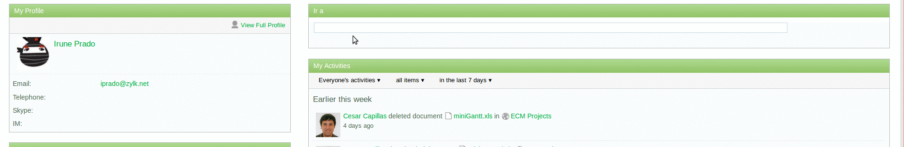

# Alfresco Share Quick Search Dashlet
*~performed during 2013*

A dashlet for the share interface that lets you make a quick search by name, providing user a navigation to the found path.

## configuration

[zk-quick-navigation.get.config.xml] (alfresco/web-extension/site-webscripts/org/alfresco/components/dashlets/zk-quick-navigation.get.config.xml)

- showInBrowse: [ true | false]  if true, performed navigation will go to share browser interface, else to the detail of the selected item 
- showInSite:	[ true | false ] if true and site path, the performed navigation will be shown in the site document library, else in the general repository. 

## changelog	

**0.3**
* del. repositoryRootPath from the config file, it's setted from alfresco documentLibrary > root-node
* fix. showInSite=false
* add. loading / no results icon
	
**0.2** 
* fix. #14766 - getNavigationUrl
* add. enable the usage of the dashlet in a site
* fix. deep paths

**0.1**
* init
* config.dashlet 'showInBrowse', 'showInSite', 'repositoryRootPath'			
